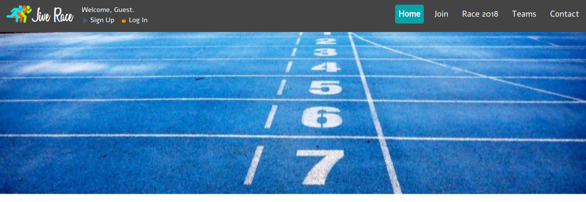
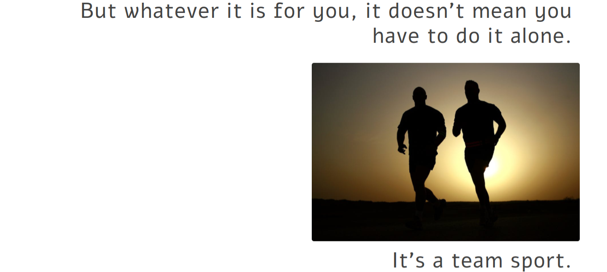

# Jive Race

Jive Race is a team-building race application. Users can register for races and create and build teams of runners. This app is built to visualize the [Jive Race API](https://jive-race-api.herokuapp.com).

**Note:** This app is still in development.

### Build Frameworks

This project is built on [React](https://reactjs.org/) with [React Router 4](https://www.npmjs.com/package/react-router-dom), hosted on [AWS S3](https://aws.amazon.com/s3/). 

### Dependencies

- [Bootstrap 4](https://getbootstrap.com/)
- [Sass](http://sass-lang.com/)
- [reactstrap](https://reactstrap.github.io/)
- [react-markdown](https://github.com/rexxars/react-markdown)
- [create-react-app](https://github.com/facebookincubator/create-react-app)
- [node-sass-chokidar](https://github.com/michaelwayman/node-sass-chokidar)
- [npm-run-all](https://github.com/mysticatea/npm-run-all)

### Testing

This application uses [Jest](https://facebook.github.io/jest/) with [Enzyme](http://airbnb.io/enzyme/) for testing. Test files are colocated with their associated component files.

### Project Objectives

These objectives are for the entire project. The goal was to create a user experience built on the [Jive Race API](https://jive-race-api.herokuapp.com) to support these objectives.

**Guests.**
- Guests can view static content about the current race.

**Users.**
- Users can register for an account and obtain an authentication token.
- Users can register for the current race and pay a fee.

**Runners.**
- Runners can view available teams for the current race.
- Runners can either create a team or join an existing team for the current race.
- Runners can leave their team for a different team, being prompted to transfer ownership if needed.
- Runners can communicate within teams and set a team meeting place for the race.
- Runners can view their own race results and results for their team.

**Admins.**
- Admin users can manage users, teams, races, and results.

### Setup

A development version of this app can be run by cloning the repository, installing dependencies, and then running `npm start`.

```
$ git clone https://github.com/jestann/jive-race.git <jive-race>
$ npm install
$ npm start
```

This runs the app on a development server with live reloading. To generate a production build use `npm run build`.

### Configuration

This repository builds on the [Jive Race API](https://jive-race-api.herokuapp.com). Configuration information is located in `src/tools/fetcher.js`.

### File Structure

This app has the following file structure. 

**Note:** The directory `src/css` holds the `.css` files compiled using `node-sass-chokidar`. All style editing should be done in the `.scss` files in the `src/styles` directory.

```
├── public
│   └── ...
├── src
│   ├── assets
│   │   ├── fonts
│   │   │   └── ...
│   │   ├── icons
│   │   │   └── ...
│   │   └── images   
│   │       └── ...
│   ├── components
│   │   └── ...
│   ├── content
│   │   └── ...
│   ├── css
│   │   └── ...
│   ├── styles
│   │   └── ...
│   ├── templates
│   │   └── ...
│   ├── tools
│   │   └── ...
│   └── index.js
├── .gitignore
├── package-lock.json
├── package.json
└── README.md
```

### Currently in Development

This app is still in development. These are the current development objectives.

- [X] Overhaul custom design scheme to improve mobile experience and implement [Bootstrap](https://getbootstrap.com/) and [Sass](http://sass-lang.com/).
- [X] Add markdown rendering for static content.
- [X] Refactor all modules and file system to better integrate state management and container/component paradigms.
- [ ] Flesh out unit testing on existing visual components, emphasizing testing business logic.
- [ ] Fully integrate authentication functionality with API and across entire site.
- [ ] Integrate model show pages with API and add edit/delete buttons based on user authorization. 
- [ ] Integrate team membership functionality with API.
- [ ] Integrate separate state management/change modules and store.

The basic visual components and design functionality have been built, along with a full custom module for integrating asynchronous API requests and authentication state management with the rest of the application.

### Visuals

The most recent visuals for the user experience are below.

#### Main







#### Mobile Experience


##### Mobile Navigation


##### Mobile User Options 


##### Mobile Login
